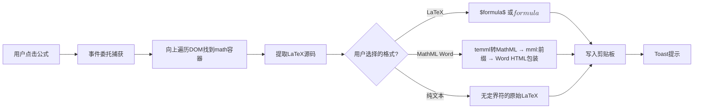

# Gemini Voyager 公式复制功能 — 深度技术剖析

## 架构总览

[FormulaCopyService.ts](file:///c:/Users/zhang/Desktop/GeminiHelper/_reference/gemini-voyager/src/features/formulaCopy/FormulaCopyService.ts) 是一个 **666 行的单例服务类**，负责"点击公式 → 复制到剪贴板"的完整生命周期。



---

## 核心机制逐层拆解

### 1. 事件委托 (Click Delegation)

不在每个公式上绑事件，而是在 `document` 级别用**捕获阶段**监听：

```javascript
document.addEventListener('click', this.handleClick, true);  // true = capture phase
```

**为什么用捕获阶段？** 因为 Gemini 的 Angular 框架可能在冒泡阶段拦截点击事件。用捕获阶段能确保我们的处理器**先于**框架接收到事件。

### 2. 定位公式节点 (`findMathElement`)

从点击目标开始，按优先级向上查找：

| 优先级 | 选择器 | 适用平台 |
|--------|--------|----------|
| 1 | `[data-math]` | Gemini |
| 2 | `.math-inline, .math-block` | Gemini |
| 3 | `ms-katex` | AI Studio |
| 4 | `.katex` → 向上找 `ms-katex` | AI Studio |

**关键细节**：对于 `.math-inline/.math-block`，它还会调用 `findDataMathInSubtree` 深入子树搜索 `data-math` 属性，因为有时候 `data-math` 不在容器本身，而是在内部某个子元素上。

### 3. 提取 LaTeX 源码 (`extractLatexSource`)

三级回退策略：

```
1. element.getAttribute('data-math')           ← Gemini 主要来源
2. element.querySelector('annotation[encoding="application/x-tex"]').textContent  ← AI Studio
3. element.querySelector('annotation').textContent  ← 兜底
```

**这与我们的设计完美对接**：因为我们在"重包装"时已经把干净的 LaTeX 写进了 `data-math` 属性！这意味着如果未来集成公式复制功能，我们的修复节点**直接就能被识别到**。

### 4. 三种输出格式

#### 格式 A: `latex`（默认）
最简单 — 根据 `displayMode` 决定包裹 `$...$` 还是 `$$...$$`：
```javascript
const wrapped = isDisplayMode ? `$$${formula}$$` : `$${formula}$`;
return { text: wrapped };
```

#### 格式 B: `no-dollar`
直接返回裸 LaTeX，不加任何定界符。适合粘贴到已有数学环境的编辑器中。

#### 格式 C: `unicodemath`（实际是 Word MathML）
**最复杂的部分**，完整流程如下：

1. **去除定界符**：`stripMathDelimiters` 剥掉 `$`, `$$`, `\[`, `\(` 等
2. **LaTeX → MathML**：使用 [temml](https://temml.org/) 库（不是 KaTeX！）将 LaTeX 转为 MathML XML
3. **清理注解**：移除 `<annotation>` 和 `<semantics>` 包装层
4. **清理样式**：移除所有 `class` 和 `style` 属性（Word 不认识）
5. **加 `mml:` 前缀**：Word 要求 MathML 标签带命名空间前缀（如 `<mml:mfrac>` 而非 `<mfrac>`）。通过递归遍历整棵 DOM 树实现
6. **包装 HTML**：用 `<!--StartFragment-->` / `<!--EndFragment-->` 标记包裹，这是 Windows 剪贴板的标准约定

### 5. 剪贴板写入 (`copyToClipboard`)

使用现代 `Clipboard API` 实现**多 MIME 类型写入**：

```javascript
const items = {
    'text/plain': new Blob([text], { type: 'text/plain' }),
    'text/html':  new Blob([html], { type: 'text/html' }),       // Word MathML HTML
    'application/mathml+xml': new Blob([text], { ... })           // 纯 MathML
};
await navigator.clipboard.write([new ClipboardItem(items)]);
```

**降级策略**：如果浏览器不支持 `clipboard.write`（或 MathML MIME 被拒），回退到 `document.execCommand('copy')` 的传统方式。

### 6. 格式偏好持久化

通过 `chrome.storage.sync`（跨设备同步）存储格式偏好，并用 `storage.onChanged` 实时监听变化 — **与我们的开关同步机制完全一致**。

---

## 可集成性评估

| 项目 | 难度 | 说明 |
|------|------|------|
| 基础点击复制 (LaTeX) | ⭐ 极简 | 我们已有 `data-math`，只需加事件委托 + 剪贴板写入 |
| 纯文本格式 (no-dollar) | ⭐ 极简 | 去掉 `$` 包裹即可 |
| Word MathML 格式 | ⭐⭐⭐⭐ 较难 | 需要引入 `temml` 库(~100KB) + 实现 `mml:` 前缀递归 |
| Toast 提示 | ⭐⭐ 简单 | 纯 DOM 操作，可直接移植 |
| 格式选择器 UI | ⭐⭐ 简单 | 在 popup 里加 radio group |

> **结论**：基础的"点击复制 LaTeX"几乎是零成本集成。Word MathML 是高级功能，需要额外依赖但技术路径清晰。
